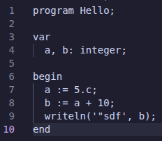

# MDC-Tubes-IF2224-2026

> Tugas Besar IF2224 Teori Bahasa Formal dan Automata

 

## Identitas Kelompok

- Ariel Cornelius Sitorus - 13524085
- Muhammad Haris Putra Sulastianto - 13524085
- Vara Azzara Ramli Pulukadang - 13524091
- Nathan Adhika Santosa - 13524041

## Deskripsi Program

Program ini adalah implementasi lexer berbasis DFA untuk bahasa pemrograman Arion. Lexer membaca file kode sumber, memindai karakter per karakter, lalu menghasilkan daftar token sesuai spesifikasi bahasa Arion.

Token yang dikenali meliputi literal (integer, real, karakter, string), operator aritmatika dan relasional, keyword, identifier, delimiter, serta komentar. Total ada 52 jenis token. Komentar dikenali tapi tidak ditampilkan di output.

Cara kerja program:

1. Baca file input dari argumen command line.
2. Jalankan lexical analysis menggunakan kelas `Lexer`.
3. Cetak token ke terminal.
4. Kalau path output diberikan, tulis juga ke file.

## Requirements

- Compiler C++ yang mendukung C++17, misalnya `g++`
- `make` untuk build
- Shell yang mendukung perintah Unix (`mkdir -p`, `rm -rf`)

Untuk pengguna Windows, disarankan pakai WSL atau Git Bash karena Makefile menggunakan sintaks Unix.

## Cara Instalasi dan Penggunaan Program

## Pembagian Tugas

| Nama                             | Tugas |
| -------------------------------- | ----- |
| Ariel Cornelius Sitorus          | ...   |
| Muhammad Haris Putra Sulastianto | ...   |
| Vara Azzara Ramli Pulukadang     | ...   |
| Nathan Adhika Santosa            | ...   |
