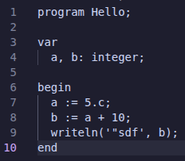

# MDC-Tubes-IF2224-2026

> Tugas Besar IF2224 Teori Bahasa Formal dan Otomata  
> Milestone 4 - Intermediate Code Generator & Interpreter

<p align="center">
  
</p>

## Identitas Kelompok

| NIM      | Nama                             |
| -------- | -------------------------------- |
| 13524041 | Nathan Adhika Santosa            |
| 13524053 | Muhammad Haris Putra Sulastianto |
| 13524085 | Ariel Cornelius Sitorus          |
| 13524091 | Vara Azzara Ramli Pulukadang     |

---

## Deskripsi Program

Program ini merupakan implementasi akhir compiler/interpreter untuk bahasa pemrograman **Arion**.

Pada milestone terakhir ini, program sudah menjalankan pipeline lengkap:

```text
Source Code
-> Lexer
-> Parser
-> AST Builder
-> Semantic Analyzer
-> Intermediate Code Generator
-> Interpreter
-> Output Program
```

Program membaca source code Arion, melakukan analisis leksikal, sintaksis, dan semantik, lalu menghasilkan **Intermediate Code** dan mengeksekusinya menggunakan interpreter berbasis **stack machine**.

Fitur utama yang sudah didukung:

- tokenisasi source code Arion;
- parsing dan pembentukan AST;
- semantic analysis dan Decorated AST;
- symbol table dan lexical scope;
- intermediate code generation;
- eksekusi instruksi stack machine;
- assignment dan ekspresi aritmatika;
- `if`, `while`, `repeat`, `for`, dan `case`;
- procedure dan function;
- recursive function;
- array dan record;
- `write`, `writeln`, dan `readln`;
- runtime protection untuk out-of-bounds array access, division by zero, numerical overflow, stack overflow, dan invalid memory access.

---

## Requirements

- C++17
- GNU Make
- GCC / Clang / MinGW-w64

Cek instalasi:

```bash
g++ --version
make --version
```

---

## Cara Instalasi dan Penggunaan Program

### Quick Start

Kompilasi program dari root repository:

```bash
make
```

Jalankan pengujian bawaan:

```bash
make run
```

Bersihkan hasil kompilasi:

```bash
make clean
```

### Menjalankan Program Manual

Format umum dijalankan dari root repository:

```bash
./bin/lexer <input_file>.txt <output_file>.txt

# Contoh:
./bin/lexer test/milestone-4/check/full_case.txt test/milestone-4/output/full_case_out.txt
```

`<output_file>` bersifat opsional.

### Windows (PowerShell / Git Bash / WSL)

Kompilasi program:

```bash
make
```

Jalankan program secara manual dari root repository:

```bash
./bin/lexer.exe test/milestone-4/check/full_case.txt test/milestone-4/output/full_case_out.txt
```

Untuk PowerShell, gunakan:

```powershell
.\bin\lexer.exe test\milestone-4\check\full_case.txt test\milestone-4\output\full_case_out.txt
```

### Linux

Kompilasi program:

```bash
make
```

Jalankan program secara manual dari root repository:

```bash
./bin/lexer test/milestone-4/check/full_case.txt test/milestone-4/output/full_case_out.txt
```

---

## Contoh Pengujian Milestone 4

Dijalankan dari root repository:

```bash
make

./bin/lexer test/milestone-4/check/full_array_oob.txt test/milestone-4/output/full_array_oob_out.txt
./bin/lexer test/milestone-4/check/full_case_nomatch.txt test/milestone-4/output/full_case_nomatch_out.txt
./bin/lexer test/milestone-4/check/full_for.txt test/milestone-4/output/full_for_out.txt
./bin/lexer test/milestone-4/check/full_downto.txt test/milestone-4/output/full_downto_out.txt
./bin/lexer test/milestone-4/check/full_case.txt test/milestone-4/output/full_case_out.txt
./bin/lexer test/milestone-4/check/full_array.txt test/milestone-4/output/full_array_out.txt
./bin/lexer test/milestone-4/check/full_record.txt test/milestone-4/output/full_record_out.txt
./bin/lexer test/milestone-4/check/full_readln.txt test/milestone-4/output/full_readln_out.txt
./bin/lexer test/milestone-4/check/full_real.txt test/milestone-4/output/full_real_out.txt
./bin/lexer test/milestone-4/check/full_overflow.txt test/milestone-4/output/full_overflow_out.txt
./bin/lexer test/milestone-4/check/full_stack_overflow.txt test/milestone-4/output/full_stack_overflow_out.txt
```

---

## Struktur Direktori

```text
.
├── bin/                    # hasil kompilasi
├── doc/                    # gambar dan dokumen pendukung
├── src/                    # source code program
│   ├── lexer.cpp / lexer.hpp
│   ├── parser.cpp / parser.hpp
│   ├── ast.cpp / ast.hpp
│   ├── semantic.cpp / semantic.hpp
│   ├── codegen.cpp / codegen.hpp
│   ├── interpreter.cpp / interpreter.hpp
│   └── main.cpp
├── test/                   # testcase
│   └── milestone-4/
│       ├── check/
│       └── output/
├── Makefile
└── README.md
```

---

## Pembagian Tugas (M4)

| Nama                             | Tugas                                                                                  |
| -------------------------------- | -------------------------------------------------------------------------------------- |
| Nathan Adhika Santosa            | Integrasi parser, AST, semantic analyzer, code generator, dan testcase syntax-semantic |
| Muhammad Haris Putra Sulastianto | Implementasi dan perapihan Intermediate Code Generator, testing, dan laporan           |
| Ariel Cornelius Sitorus          | Implementasi interpreter, stack machine, activation record, dan operasi OPR            |
| Vara Azzara Ramli Pulukadang     | Runtime protection, validasi array/record, dokumentasi, dan verifikasi testcase        |
